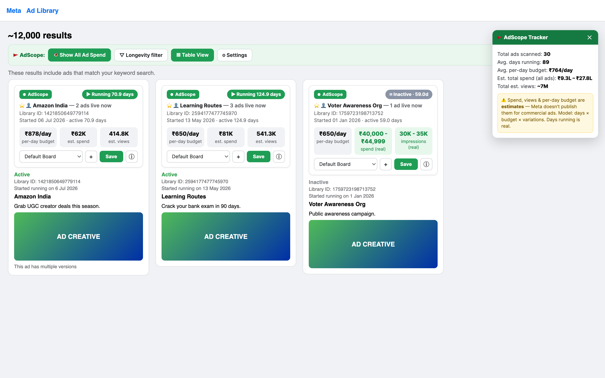

# AdScope for Meta Ad Library

A Chrome extension (like AdLens / AdLibSpy) that overlays competitor-ad metrics **directly on top of the [Meta Ad Library](https://www.facebook.com/ads/library/)** as you browse. Built for the Learnyst marketing team to spy on edtech competitors.



> _Mock preview of the in-page UI. Days running is real; spend, views and per-day budget are transparent estimates (see below)._

It injects a green **info card stacked on top of every ad** (in normal flow, so it never overlaps Meta's own card), a **summary panel** (top-right), and a **toolbar** — mirroring the "Ads Library Tracker" layout. Each card shows:

| Metric | What it is | Source |
|---|---|---|
| ⏱️ **Days running** | How long the ad has been live | **REAL** — read from Meta's "Started running on" date |
| 💸 **Per-day budget** | Modelled daily spend for that ad | **ESTIMATE** — assumed daily budget × variation factor |
| 💰 **Est. spend** | Modelled total spend | **ESTIMATE** — days × per-day budget |
| 👁️ **Est. views** | Modelled impressions | **ESTIMATE** — est. spend ÷ CPM |

It also shows the advertiser and **how many of their ads are live**, and each card is colour-accented by longevity: **green = 30+ days** (likely a proven winner — advertisers only keep paying to run ads that convert), **amber = 7–29 days**, **grey = new**.

**In-page UI:**
- **Summary panel** (top-right): total ads scanned, avg. days running, **avg. per-day budget**, est. total spend (as a range), total est. views. Closeable.
- **Toolbar** (below the results count): *Show All Ad Spend* (hide/show the money tiles), *Longevity filter* (All → 7+ → 30+ days, dims the rest), *Table View*, *Settings*.
- **Table View**: a sortable-by-longevity table of every scanned ad (advertiser, status, days, per-day, est. spend, est. views, started) with **Download CSV**.
- **Save**: bookmark an ad to a board (stored locally).

---

## ⚠️ Real vs. estimated — read this first

This is the honest limitation every tool in this category (AdLens, AdLibSpy, Foreplay, AdSpy…) shares, because it comes from Meta, not from the tool:

- **Days running is REAL.** It's parsed straight from the date Meta prints on every card. This is the single most reliable signal, and the one professional ad buyers trust most.
- **Spend and views are ESTIMATES for ordinary commercial ads.** Meta **does not publish** spend, budget, or impressions for normal commercial ads (like a competitor's course ad). Any tool that shows you a spend/views number for such an ad is **modelling it**, not reading real data. AdScope models it transparently as:

  ```
  est. spend  = days_running × your assumed daily budget × variation_factor
  est. views  = est. spend ÷ CPM × 1000
  variation_factor = 1 + 0.35 × (versions − 1), capped at 4×   (extra creatives
                     usually share one budget, so this is sublinear)
  ```

  Accuracy is **order-of-magnitude** (could be several times high or low). Use the numbers to **compare competitors relatively** — who's spending more, who's scaling — **not** as exact rupee figures. Tune the assumptions in the popup to your market.

- **Where Meta DOES publish real numbers, AdScope shows them** (in green, labelled "real"):
  - **Political / social-issue ads** → real spend & impression ranges.
  - **Ads run in the EU** → real EU reach (Digital Services Act).
  - **"Low Impression Count"** ads (<100 people reached) → shown as a real signal.

Defaults are tuned for **Indian edtech** (₹650/day assumed budget, ₹150 CPM). Change currency and assumptions in the popup.

---

## Install (unpacked — 60 seconds)

1. Open **`chrome://extensions`** in Chrome (or Edge/Brave).
2. Turn on **Developer mode** (top-right toggle).
3. Click **Load unpacked**.
4. Select this folder: **`adscope-extension`**.
5. Pin **AdScope** to your toolbar (puzzle-piece icon → pin).

Then open the [Meta Ad Library](https://www.facebook.com/ads/library/?active_status=active&ad_type=all&country=IN&media_type=all), search a competitor, and badges appear on each ad. Click the AdScope toolbar icon for the summary, settings, and CSV export.

> The extension reads only the public Ad Library page you're on. **No data leaves your browser.** Nothing is sent to any server.

---

## Using it

- **Search a competitor:** In the Ad Library set *Ad category = All ads*, pick your country (default IN), and search the brand name or a keyword.
- **Find winners fast:** Scroll and look for **green** badges (30+ days). A long-running ad is the strongest public signal that a creative is profitable.
- **Popup summary:** ads scanned on the page, average days live, total estimated spend/views, the longest-running ad, and how many ads the advertiser is running in total (`~N results` — a strong budget signal).
- **Export CSV:** one click in the popup exports every ad scanned (library ID, page, dates, days running, variations, platforms, CTA, real + estimated figures) for a spreadsheet.
- **Tune estimates:** switch ₹/$ and edit the assumed daily budget and CPM to match the competitor's likely market and objective.

---

## Tuning the estimate (optional)

From the CPM research the defaults are based on:

- **India, edtech:** CPM ₹80–300 (central ₹150). Daily budget bands per active ad: testing ₹200–500, evergreen ₹500–1,500, scaled ₹1,500–5,000+.
- **Do NOT use global/US edtech CPM (~₹1,400) for India** — Indian CPMs run ~90% lower; it would overstate spend ~10×.
- **The advertiser's total ad count** (`~N results`) is a stronger budget signal than any single ad — many concurrent ads = a big, dedicated budget.

---

## Why it keeps working when Meta changes things

Meta obfuscates and rotates its CSS class names on nearly every deploy, and even poisons the word "Sponsored" with hidden characters to break scrapers. AdScope never relies on class names — it anchors only on stable, human-visible text (`Library ID:`, `Started running on`) and walks the DOM from there, and it handles the virtualized (recycling) results grid by de-duplicating on Library ID. If Meta makes a big structural change and badges stop appearing, the fix is usually small.

## Files

```
adscope-extension/
├── manifest.json     MV3 manifest
├── content.js        scrapes each ad card + injects the badge
├── content.css       badge styling
├── popup.html/.js/.css   toolbar popup: summary, settings, CSV export
├── background.js     seeds default settings on install
└── icons/            extension icons
```

## Notes & limits

- Works on the **public** Ad Library — you don't need to be logged in, but heavy/fast scrolling can make Meta rate-limit or show a CAPTCHA (that's Meta, not the extension).
- Inactive commercial ads disappear from the library outside the EU the moment a campaign stops — there's no historical archive for them.
- This is an unpacked/dev extension for internal use. Automated access to Meta surfaces is against Meta's Terms of Service; use responsibly for manual competitive research.

## License

[MIT](LICENSE) © Learnyst
